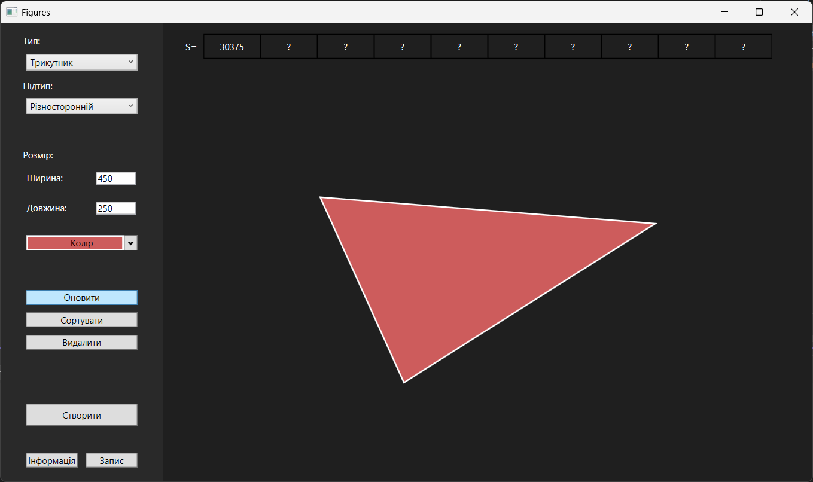
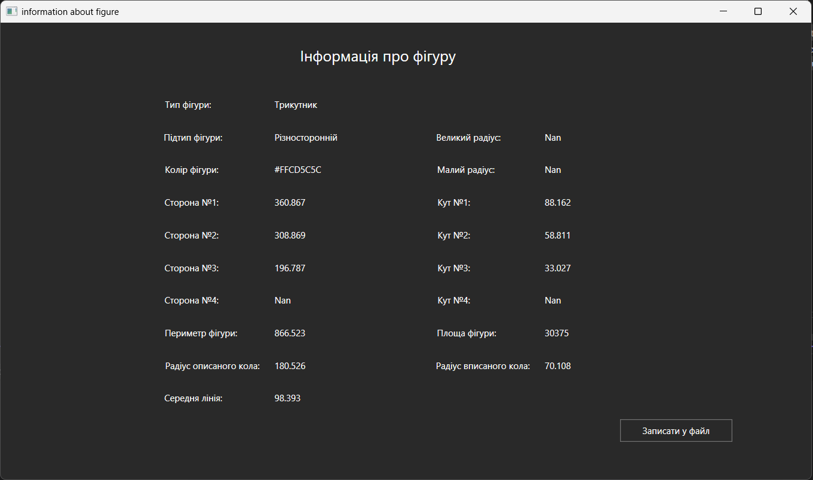
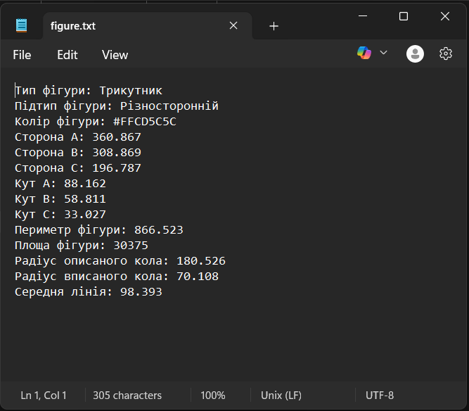

# Figure Builder (Desktop Application in WPF)
Figure Builder is a desktop application for creating, visualizing, and analyzing two-dimensional geometric figures. Built with WPF and C#, it provides interactive tools to work with various types of shapes. Users can define dimensions, change colors, scale figures, and access detailed information about their properties such as area, perimeter, angles, radii, and more.

## How to Run

1. Clone the repository:
   ```bash
   https://github.com/TanyaTverdun/Figure_Builder.git
   ```
2. Open the project in **Visual Studio**.
3. Build and run the solution.
4. Create and interact with figures through the interface.

## Key Features

- **Shape Selection**  
  Ability to choose the type (triangle, quadrilateral, circle) and subtype (equilateral, rectangle, rhombus, etc.) of geometric figures.

- **Drawing and Visualization**  
  Dynamic rendering of figures on a canvas based on user-defined dimensions.

- **Geometric Analysis**  
  Display of detailed information about each figure, including:
  - Area and perimeter
  - Side lengths
  - Interior angles
  - Radius of the inscribed and circumscribed circle
  - Length of the midline

- **Color Filling**  
  Users can choose any color to fill the figure.

- **Scaling**  
  Resizing figures while preserving proportions.

- **Data Saving**  
  Save individual or all created figures to a file.

- **Sorting**  
  Store up to 10 test figures and sort them by area using the Shell Sort algorithm.

## Technologies Used

- **C#** and **WPF** (.NET)
- UI design using **XAML**
- Delegates and events for UI updates
- Object-oriented design (inheritance, polymorphism, encapsulation)
- Exception handling
- File operations (saving data)
- Implementation of sorting algorithm (Shell Sort)

## Project Structure

- `MainWindow.xaml` — main application window
- `Figures.cs` — base class for all figures
- `Triangle_*.cs`, `Rectangle_*.cs` — specific figure implementations
- `Enums.cs` — enumerations for figure types and subtypes
- `Exception.cs` — custom exception classes
- `WriteToFile.xaml`, `InfoWindow.xaml` — additional UI windows

## Screenshots

### Main window



### Information window



### Data file



## Author

**Tetyana Tverdun**  
Student of Software Engineering, Group PZ-22  
Lviv Polytechnic National University
